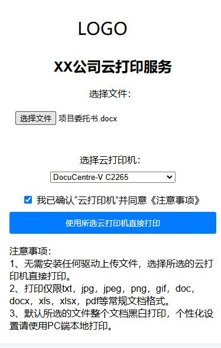

### 云打印服务 Cloud Printer
一个简单的提供WEB页面的云打印服务。
客户端（移动或终端PC）无需安装驱动，通过web上传文件直接打印。

## 前言
您是否有以下经历？
公司打印机品牌复杂，打印机驱动安装繁琐，每次需要手机微信转发打印？

## 原理
您只需要安装一台打印服务器，手机或者电脑通过web服务上传文件给打印服务器，打印服务器调用默认程序直接打印文件。

## 部署
1、准备一台windows或者windows server。
2、安装办公软件（office或WPS，PDF），安装您本地的打印机驱动。
3、安装python环境。
4、安装必要依赖模块，pip install -r requirements.txt
5、启动服务python app.py

### 效果

### 打赏

> 如果您觉得对您有帮助，欢迎给我打赏。

